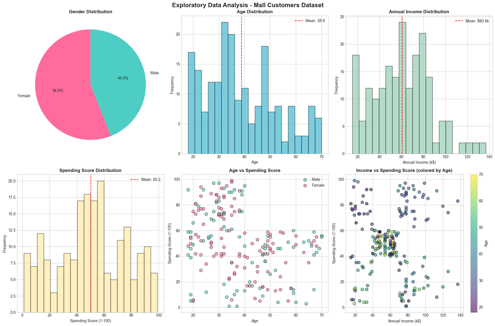
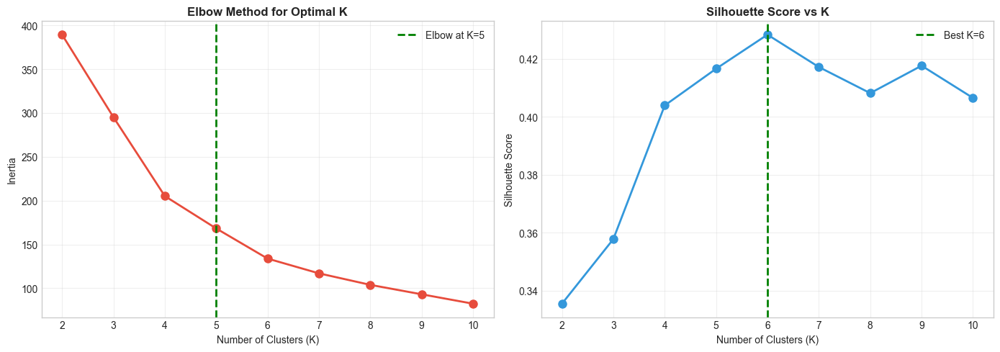
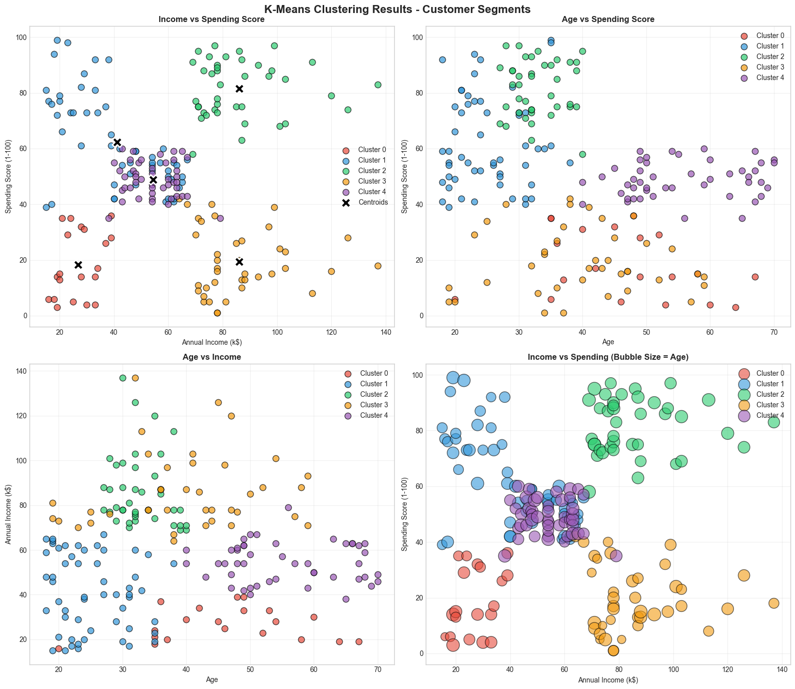
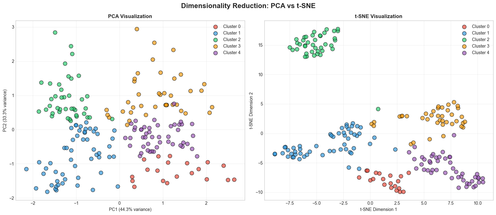
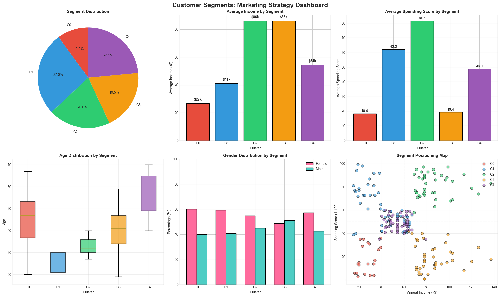

# Mall Customer Segmentation (K-Means)

Customer segmentation using K-Means clustering on the Mall Customers dataset, with PCA/t-SNE validation and segment-level marketing strategy recommendations.

## Task Objective

A mall wants to understand its customer base to optimize marketing strategies. This project segments 200 customers based on demographic and spending behavior data using unsupervised machine learning, then proposes targeted marketing strategies for each resulting segment.

**Dataset:** Mall Customers Dataset, 200 customers, 5 features (CustomerID, Gender, Age, Annual Income, Spending Score).

## Approach

1. **Data cleaning and preprocessing** : checked for missing values and duplicates (none found), encoded the Gender column for reference.
2. **Exploratory Data Analysis** : examined the distributions of age, income, spending score, and gender, and looked at pairwise relationships between them.
3. **Model building and evaluation** : standardized the features (Age, Annual Income, Spending Score) and ran K-Means across K=2 through K=10, evaluating each with the Elbow Method (inertia) and Silhouette Score.
4. **Final clustering** : fit K-Means with K=5 to produce five customer segments, then profiled each by average age, income, and spending score.
5. **Dimensionality reduction** : projected the scaled features into 2D using both PCA and t-SNE to visually confirm cluster separation.
6. **Marketing strategy mapping** : translated each segment's profile into a targeted marketing approach.

## Results and Findings

### Exploratory Data Analysis

The customer base is roughly 56% female / 44% male, with age spread fairly evenly across 18-70 and income concentrated between $40k-$90k.

### Choosing K

Inertia (elbow method) flattens out around K=5, while silhouette score actually peaks at K=6. K=5 was used here for interpretability, since it produces five clean, business-readable segments; K=6 is a reasonable alternative worth testing if finer segmentation is needed.

### Clustering Results

K-Means with K=5 produced clearly separated segments across income and spending score, visible in the centroid plot below.

### Dimensionality Reduction

Both PCA and t-SNE confirm the five segments form distinct, non-overlapping groups rather than artifacts of the chosen K.

### Segment Profiles and Marketing Strategy

| Segment | Age | Income | Spending Score | Label |
|---|---|---|---|---|
| Cluster 0 | ~46 | $27k | 18 | Careful Spenders |
| Cluster 1 | ~25 | $41k | 62 | Young Spenders |
| Cluster 2 | ~33 | $86k | 82 | Premium / Target Customers |
| Cluster 3 | ~40 | $86k | 19 | Sensible Spenders (high income, low spend) |
| Cluster 4 | ~56 | $54k | 49 | Older, Moderate Spenders |

Cluster 2 (high income, high spending) is the priority segment for retention. Cluster 3 (high income, low spending) represents the largest untapped conversion opportunity. Cluster 1 is the largest segment by size and responds best to digital/social marketing.

## Tech Stack

Python, pandas, NumPy, scikit-learn (KMeans, PCA, t-SNE, StandardScaler, silhouette_score), matplotlib, seaborn

